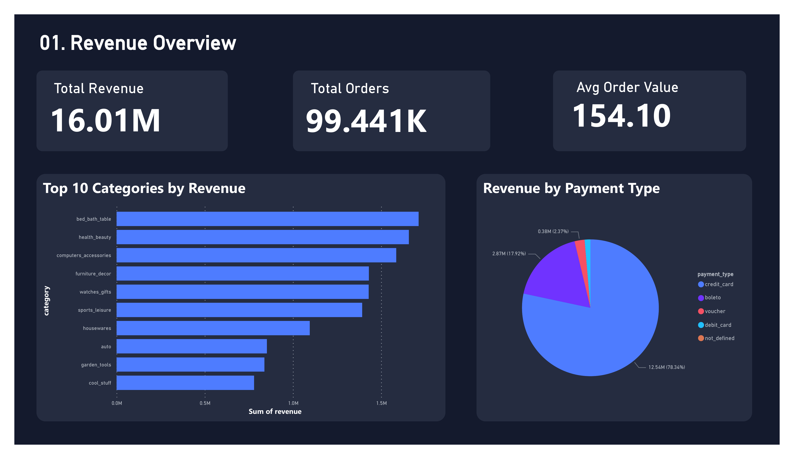
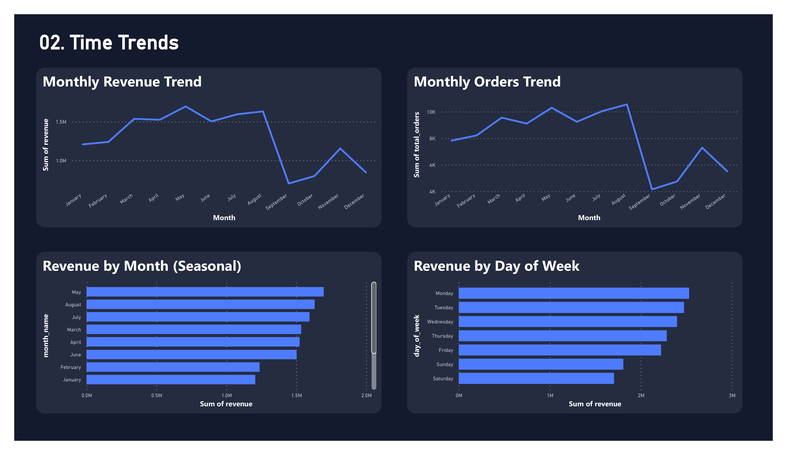
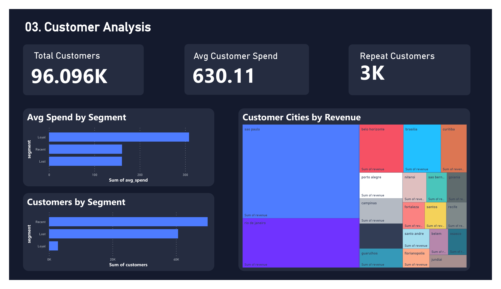
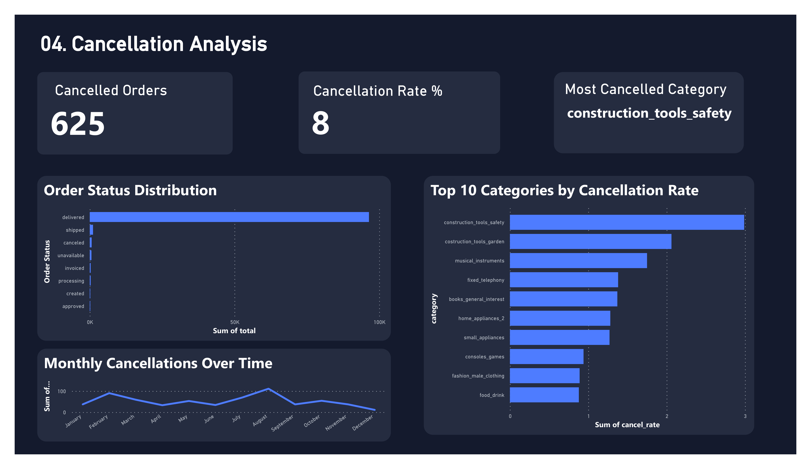
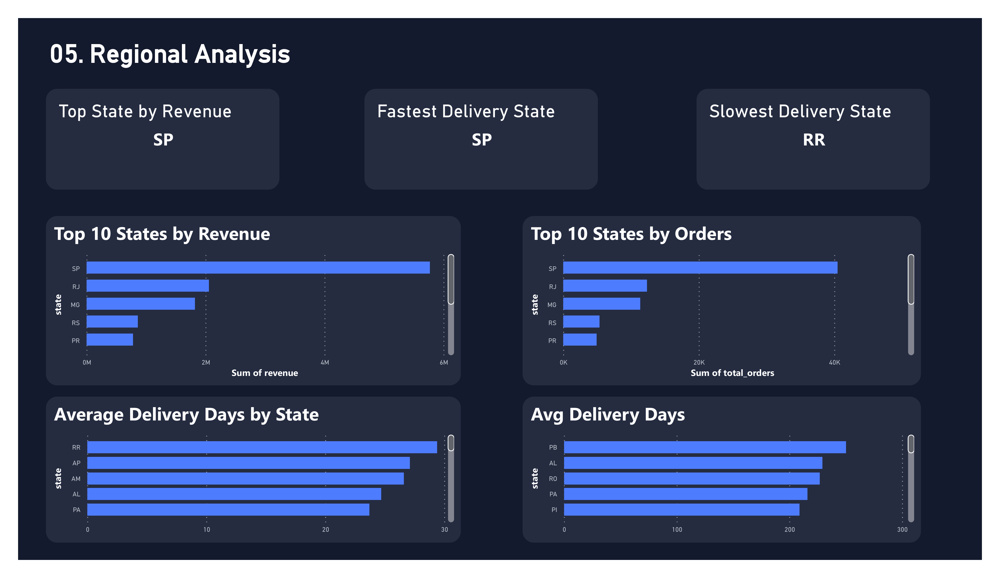

# Brazilian E-Commerce Analytics — Olist (2016–2018)


> End-to-end analytics project on 99,441 Brazilian e-commerce orders — ingestion, PostgreSQL warehousing, business rule validation, RFM segmentation, and a Power BI executive dashboard.

---

## 🎯 Project Objective

The objective of this project is to build a fully reproducible end-to-end analytics system for the Olist Brazilian e-commerce platform by transforming raw transactional data into actionable business intelligence.

Specifically, this project aims to:

- Design and implement a **layered analytics pipeline (Raw → Clean → Validated → Analytical → BI)** using Python and PostgreSQL with full data lineage and reproducibility.
- Build a **proper relational data model with correct grain management** across orders, items, payments, customers, and reviews to ensure analytical accuracy.
- Establish **automated data quality and business rule validation** to guarantee consistency, integrity, and trust in downstream reporting.
- Analyze **customer behavior, churn patterns, and RFM segments** to identify high-value and at-risk customer groups for retention strategies.
- Evaluate **revenue drivers, category concentration, and payment mix impact** to understand what influences platform growth and profitability.
- Assess **logistics and regional performance across Brazil** to identify delivery bottlenecks and infrastructure imbalance.
- Deliver a **Power BI executive dashboard connected to PostgreSQL**, enabling real-time, scalable, and decision-ready analytics for business stakeholders.

---

## 🎯 What This Project Demonstrates

- Built a reproducible analytics pipeline processing 99,441 orders with full data lineage (CSV → raw → clean → validated → BI)
- Designed a relational model with correct grain separation across orders, items, payments, and buyers
- Implemented RFM segmentation across 96,096 buyers with churn quantification (31% inactive base identified)
- Validated data integrity with 11 automated business rule assertions — 100% pass rate across all runs
- Delivered a BI-ready clean layer powering a Power BI executive dashboard via live PostgreSQL connection

---

## 🌍 Business Value

This project simulates a real-world e-commerce analytics system used to:

- Understand customer churn and identify re-engagement opportunities
- Quantify regional logistics imbalances affecting delivery performance
- Optimize payment mix strategy based on order value differences across payment types
- Identify revenue concentration risk across product categories

---

## 📌 Quick Navigation

- 📦 [Quick Summary](#quick-summary)
- 🏗️ [Architecture Overview](#-architecture-overview)
- 🏢 [Business Problem](#business-problem)
- 💡 [Key Insights](#-key-insights)
- 🚀 [Impact](#-impact)
- 📊 [Statistical Evidence](#-statistical-evidence)
- 💬 [Recommendations](#-recommendations)
- ⚠️ [Limitations](#-limitations)
- [Data Pipeline](#data-pipeline)
- ⚙️ [Tech Stack](#-tech-stack)
- 🧠 [Design Decisions](#-design-decisions)
- 📐 [Data Grain Rules](#-data-grain-rules)
- 🖼️ [Dashboard Preview](#dashboard-preview)
- 📂 [Repository Structure](#repository-structure)
- ▶️ [Setup](#setup)
- 📄 [Documentation](#documentation)

---

## Quick Summary

| | |
|---|---|
| 📦 **Dataset** | Olist Brazilian E-Commerce — October 2016 to August 2018 |
| 🗃️ **Scale** | 99,441 orders · 96,096 unique buyers · 3,095 sellers · 71 product categories |
| ⚙️ **Stack** | Python · PostgreSQL · Pandas · SQLAlchemy · JupyterLab · Power BI |
| 🧪 **Validation** | 11 business rule checks — PASS: 11, FAIL: 0 |
| 📊 **Output** | Power BI executive dashboard (5 pages) · 8 analysis notebooks · RFM segmentation |

---

## Key Metrics at a Glance

| Metric | Value |
|---|---|
| Total Revenue | BRL 16.0M |
| Orders | 99,441 |
| Avg Order Value | BRL 160.99 |
| Active Buyers | 96,096 |
| Repeat Purchase Rate | 3.5% |
| Cancellation Rate | 0.63% |
| Avg Delivery Time | 12.4 days (system-wide) |
| Data Quality Pass Rate | 11 / 11 checks (100%) |

---

## 🏗️ Architecture Overview

This project follows a layered analytics architecture:

```
Raw Layer → Clean Layer → Validated Layer → Analytical Layer → BI Layer
```

All transformations are reproducible and fully traceable via a Python + PostgreSQL + Makefile pipeline. Each stage is independently re-executable with overwrite semantics — no manual cleanup required between runs.

---

## Business Problem

Olist connects small Brazilian sellers to major retail platforms. Despite high delivery rates, the business faces low repeat purchase rates, uneven regional performance, and category-concentrated revenue risk.

This project answers:

- Which product categories and payment types drive revenue?
- How do orders and revenue trend across months and days of the week?
- Who are the high-value customers, and how many are at risk of churning?
- What drives order cancellations — and which categories are most affected?
- How does delivery performance vary across Brazil's 27 states?

---

## 💡 Key Insights

1. **BRL 16.0M revenue from 96,478 delivered orders** — true average order value of BRL 160.99, placing Olist in the everyday consumer goods segment.
2. **Three categories dominate GMV** — bed & bath (BRL 1.71M), health & beauty (BRL 1.66M), and computers & accessories (BRL 1.59M) represent a disproportionate share of platform revenue.
3. **São Paulo is the engine of the platform** — SP generates 40.7% of orders and 36% of revenue; the top 3 states (SP, RJ, MG) account for 64% of total volume.
4. **Credit card users show ~12% higher AOV than boleto users in this dataset** — BRL 163 vs BRL 145 (mean comparison), likely driven by Brazilian installment payment behavior (parcelamento) enabling larger purchases.
5. **31% of buyers are inactive but have similar spend to active users** — At Risk and Lost segments average BRL 162–166 per order vs BRL 160–185 for active cohorts. Churn, not low value, is the issue.
6. **Delivery times vary 3x across regions** — São Paulo averages 8.8 days; Amazonas averages 26.4 days, indicating infrastructure imbalance rather than seller-level variance.
7. **Cancellation rate is low overall (0.63%) but concentrated in specific categories** — rate-adjusted analysis reveals niche categories with disproportionate cancellation risk, pointing to seller-side fulfillment issues.
8. **Only 3.5% of buyers made a repeat purchase** — the platform operates in high-acquisition, low-retention mode, making loyalty programs an untapped growth lever.

---

## 🚀 Impact

- **Revenue insight →** Credit card users show ~12% higher AOV than boleto users (BRL 163 vs BRL 145) in this dataset — a measurable input for payment mix decisions.
- **Churn insight →** 31% of buyers (29,087 customers) are inactive but have comparable spend to active users — a quantifiable, high-value re-engagement target base.
- **Operations insight →** 3x delivery time gap between SP and northern states (AM, PA) indicates a regional infrastructure imbalance, not seller performance differences.
- **Engineering insight →** 11 automated data quality checks on every pipeline run, with timestamped JSON audit logs, enabling full reproducibility and downstream trust.
- **Lineage insight →** 0 orphaned rows across all 5 foreign key relationships — verified at ingestion and re-validated on every run.

---

## 📊 Statistical Evidence

> All metrics are computed at order-level grain unless explicitly stated otherwise.

| Metric | Value |
|---|---|
| Total revenue (delivered orders) | BRL 16,008,872 |
| True avg order value | BRL 160.99 (order-level aggregation, not payment-row level) |
| Top category by revenue | Bed & bath — BRL 1,712,554 |
| Credit card share | 73.1% of orders · 78.3% of revenue |
| Credit card AOV vs boleto AOV | BRL 163.32 vs BRL 145.03 (mean comparison, this dataset) |
| Peak revenue month | November 2017 — BRL 1,153,528 |
| Strongest order day | Monday — 15,701 orders |
| Cancellation rate | 0.63% (625 of 99,441 orders) |
| Repeat buyer rate | 3.5% (3,345 of 96,096 unique buyers) |
| Review score avg | 4.09 / 5 (bimodal: heavy 5-star spike + secondary 1-star spike) |
| Fastest delivery state | São Paulo — 8.8 days avg |
| Slowest delivery state | Amazonas — 26.4 days avg |
| Highest AOV state | Paraíba (PB) — BRL 250.15, ranked 16th by order volume |

---

## 💬 Recommendations

- **Re-engage At Risk and Lost customers** — 29,087 dormant buyers with spend levels comparable to active users. Personalized campaigns have a well-defined, high-value target base.
- **Invest in northern logistics** — the delivery time gap between SP and states like AM and PA is a structural satisfaction risk. Regional carrier partnerships are the most direct lever.
- **Prepare for November demand spikes** — revenue climbs sharply in November (Black Friday). Increasing seller inventory readiness and marketing spend in October would capture more of this demand.
- **Audit high-cancellation categories** — rate-adjusted analysis identifies niche categories with elevated cancellation rates. Seller SLA reviews are the right intervention, not demand-side changes.
- **Explore loyalty or subscription models** — a 3.5% repeat rate on a 96,096-buyer base suggests significant untapped lifetime value from even modest retention improvements.

---

## ⚠️ Limitations

- **Historical dataset only** — covers October 2016 to August 2018; no real-time or live data integration.
- **No marketing or acquisition data** — customer growth drivers and CAC cannot be analyzed from this dataset alone.
- **Correlational insights only** — no causal inference; findings describe patterns in the data, not proven cause-effect relationships.
- **Seasonal analysis is partially confounded** — some months appear in only one year of data (e.g., Sep–Dec 2016 is sparse), inflating or deflating multi-year seasonal comparisons.
- **RFM frequency compression** — most customers have exactly one order, compressing F-score quartile boundaries. Segment labels reflect relative behavior within this dataset, not absolute behavioral archetypes.
- **Delivery time metric is end-to-end** — purchase timestamp to delivery timestamp; does not decompose seller processing time vs carrier transit time vs last-mile delivery.

---

## Dashboard Preview


*01 — Revenue Overview: BRL 16.01M total revenue · top 10 categories · payment type breakdown*


*02 — Time Trends: monthly revenue and order trends · seasonal patterns · day-of-week breakdown*


*03 — Customer Analysis: RFM segmentation · 96K customers · city-level revenue map*


*04 — Cancellation Analysis: 625 cancelled orders · top cancellation categories · monthly trend*


*05 — Regional Analysis: top states by revenue and orders · average delivery days by state*

---

## Data Pipeline

```
Raw CSVs (data/)
      │
      ▼
[Ingest — load_raw.py]
   pandas.read_csv → df.to_sql
      │
      ▼
PostgreSQL — 9 raw tables
(orders, customers, order_items, order_payments,
 order_reviews, products, sellers, geolocation,
 category_translation)
      │
      ▼
[Preprocess — clean.py]
   date parsing · deduplication · null fills · category joins
      │
      ▼
PostgreSQL — 5 clean tables
(orders_clean, customers_clean, products_clean,
 geolocation_clean, reviews_clean)
      │
      ▼
[Validate — assumption_test.py]
   11 business rule assertions → logs/assumption_tests/run_*.json
      │
      ▼
[Analyze — notebooks/]
   revenue · time trends · RFM segmentation · cancellations · regional
      │
      ▼
Power BI Executive Dashboard (.pbix)
```

---

## ⚙️ Tech Stack

**Data Engineering**
- Python 3.11 — ingestion, transformation, validation
- Pandas + SQLAlchemy — ETL and DB read/write
- Custom `assumption_test.py` — business rule assertions with JSON audit logs

**Storage & Serving**
- PostgreSQL 15 — raw tables, clean tables, and Power BI serving layer

**Analytics**
- JupyterLab 4 — 8 exploratory and analytical notebooks

**BI Layer**
- Power BI Desktop — Power BI executive dashboard with dynamic DAX measures

**DevOps**
- Conda — reproducible environment management
- `.env` + `python-dotenv` — credential isolation

---

## 🧠 Design Decisions

**PostgreSQL as both warehouse and serving layer** — at ~180MB and 1.6M rows, a local relational DB handles this workload cleanly. PostgreSQL provides SQL-based transformations across notebooks and native Power BI connectivity without cloud dependency.

**Pandas for preprocessing** — the dataset fits in memory. Pandas provides readable, expressive transformation code that integrates directly with SQLAlchemy. Deliberately proportionate to project scale.

**dbt and Airflow intentionally excluded** — keeping the pipeline to Python + PostgreSQL + Makefile makes it lightweight and fully reproducible on a single local machine without container orchestration overhead.

**Separate raw and clean tables** — raw tables are never modified after ingestion. Any preprocessing bug is fixable and re-runnable without re-ingesting from CSV, making lineage explicit.

**Overwrite semantics throughout** — `if_exists="replace"` on every write means the pipeline is deterministically re-runnable from scratch. Simplicity and reproducibility over incrementality — the right trade-off at this scale.

**Power BI with live PostgreSQL connection** — DAX measures aggregate against validated clean tables at query time. No pre-aggregated CSV exports needed; dashboard metrics stay trustworthy as the pipeline evolves.

---

## 📐 Data Grain Rules

| Grain | Key | Used For |
|---|---|---|
| Order | `order_id` | Revenue totals, delivery performance, cancellation analysis |
| Item | `order_id` + `order_item_id` | Category revenue, seller analysis |
| Payment | `order_id` + `payment_sequential` | Payment method split — multiple rows per order possible |
| Buyer | `customer_unique_id` | Distinct customer counts, RFM segmentation, repeat purchase analysis |

> Revenue is always computed at order-level after resolving payment splits, to avoid duplication bias from installment records. See `docs/data_dictionary_report.md` for full column-level grain notes.

> `customer_id` is order-scoped — a new value is minted per order. Use `customer_unique_id` for all buyer-level analysis. The dataset has 99,441 `customer_id` values but only 96,096 distinct buyers.

---

## RFM Segmentation

| Segment | Customers | Avg Spend (BRL) | Avg Recency (days) |
|---|---|---|---|
| Potential Loyal | 23,356 | 160.98 | 111 |
| At Risk | 23,187 | 166.41 | 363 |
| Loyal | 17,553 | 167.86 | 130 |
| Needs Attention | 17,423 | 160.50 | 335 |
| Champion | 5,938 | 185.92 | 56 |
| Lost | 5,900 | 162.22 | 451 |

Champions (highest spend at BRL 185.92, lowest recency at 56 days) are the most valuable and most recently active cohort. The At Risk + Lost cohort represents 31% of all buyers — with spend levels nearly identical to active segments, confirming churn rather than low value as the core retention problem.

---

## Data Model

```
customers_clean
    │
    └──< orders_clean
              │
              ├──< order_items >──── products_clean
              │         └─────────── sellers
              ├──< order_payments
              └──< reviews_clean

customers_clean ──> geolocation_clean (via customer_zip_code_prefix)
sellers         ──> geolocation_clean (via seller_zip_code_prefix)
```

**Referential integrity:** 0 orphaned rows across all 5 foreign key relationships — verified in `01_profile.ipynb` and re-validated on every pipeline run.

---

## Setup

Full setup instructions → [`docs/setup.md`](docs/setup.md)

**Quick start:**

```bash
git clone https://github.com/your-username/e-commerce-sales-analysis.git
cd e-commerce-sales-analysis
conda env create -f environment.yml
conda activate ecommerce-analysis
cp .env.example .env        # add DB credentials
make all                    # ingest → preprocess → validate (≈ 3.5 min)
make jupyter                # launch analysis notebooks
```

**Prerequisites:** Python 3.11 (Miniconda), PostgreSQL 15, Power BI Desktop

---

## Repository Structure

```
e-commerce-sales-analysis/
│
├── data/                          # Raw CSV files (not version controlled)
├── dashboard/                     # Power BI files (.pbix, .pbit) + screenshots
│   └── images/
│
├── docs/
│   ├── architecture_report.md            # End-to-end data flow and design decisions
│   ├── business_insights_report.md      # 15 analytical findings mapped to notebooks
│   ├── data_dictionary_report.md         # Column-level definitions for all tables
│   └── data_quality_report.md            # Null analysis, cleaning rules, validation log
│
├── notebooks/
│   ├── 00_explore.ipynb
│   ├── 01_profile.ipynb
│   ├── 02_cleaning.ipynb
│   ├── 03_revenue_analysis.ipynb
│   ├── 04_time_trends.ipynb
│   ├── 05_customer_analysis.ipynb # RFM segmentation
│   ├── 06_cancellation_analysis.ipynb
│   └── 07_regional_analysis.ipynb
│
├── src/
│   ├── config.py
│   ├── ingest/load_raw.py         # CSV → PostgreSQL (raw tables)
│   ├── preprocess/clean.py        # Raw → clean tables
│   └── validation/assumption_test.py
│
├── logs/assumption_tests/         # Timestamped JSON validation results per run
├── annotations/RFM.txt
├── .env
├── environment.yml
└── Makefile
```

---

## How to Explore This Project

1. **Start with Key Insights** — business findings at a glance
2. **Review Impact and Statistical Evidence** — quantified outcomes and supporting data
3. **Read `docs/business_insights_report.md`** — 15 analytical findings with SQL evidence and interpretation
4. **Open `notebooks/03` → `07`** — full analysis with charts
5. **Open the Power BI executive dashboard** (`dashboard/e-commerce-sales-analysis.pbix`) — final output

---

## Data Sources

| Source | Rows | Description |
|---|---|---|
| [Olist E-Commerce Dataset (Kaggle)](https://www.kaggle.com/datasets/olistbr/brazilian-ecommerce) | 99,441 orders | Orders, customers, payments, reviews, products, sellers |
| Olist Geolocation | 1,000,163 raw → 19,015 clean | ZIP prefix to lat/lng mapping (deduplicated in clean layer) |
| Product Category Translation | 71 | Portuguese → English category name mapping |

---

## Documentation

| Document | Description |
|---|---|
| [Architecture](docs/architecture_report.md) | System design, data flow, design decisions, entity relationship diagram |
| [Business Questions](docs/business_insights_report.md) | 15 findings with SQL evidence, interpretation, and limitations |
| [Data Dictionary](docs/data_dictionary_report.md) | Column definitions for all raw and clean tables |
| [Data Quality](docs/data_quality_report.md) | Null analysis, cleaning rules, validation results, known issues |

---

## Lessons Learned

- **Separating raw and clean layers** makes preprocessing bugs fixable without re-ingestion — a small discipline that pays back every iteration.
- **RFM frequency compression is a real analytical trap** — when most customers have exactly one order, F-score quartile boundaries collapse and segment labels must be interpreted relative to this dataset's behavioral range, not as absolute archetypes.
- **Grain management matters more than it looks** — `order_payments` has multiple rows per order, so `SUM(payment_value)` over the full table overstates revenue without order-level aggregation first.
- **Power BI with a live PostgreSQL connection beats CSV imports** — DAX measures aggregate against validated data at query time, keeping metrics trustworthy without pre-aggregated exports.


---

## Full Project Availability

This repository showcases the core architecture, methodology, and selected outputs of the project.

The complete implementation is maintained in a private repository because it contains proprietary work, large datasets, or materials that cannot be shared publicly.

Recruiters and hiring managers interested in reviewing the full project may contact me via LinkedIn or email to arrange access or a walkthrough.
